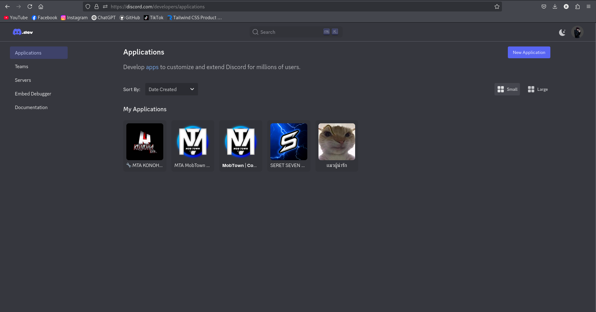

# API backend (Node.js + Express) สำหรับ Discord OAuth2 Login

โปรเจกต์นี้เป็นตัวอย่าง **API Backend** ที่ทำด้วย **Node.js + Express** เพื่อรองรับการ Login ผ่าน **Discord OAuth2**  
สามารถนำไปใช้คู่กับ **Frontend (เช่น Vite/React)** ได้เลย

---

## 🔧 Features
- Login ด้วย Discord OAuth2
- ใช้ JWT เก็บ session
- รองรับการเรียกจาก Frontend (CORS)
- Cookie-based authentication
- โครงสร้างง่าย เหมาะสำหรับทำโปรเจกต์จริง

---

## 📦 Dependencies
- express
- dotenv
- mysql2 (เชื่อมฐานข้อมูล ถ้าต้องการเก็บ user)
- discord-oauth2
- cors
- cookie-parser
- jsonwebtoken

---

## 📂 โครงสร้างโปรเจกต์ (Project Structure)
```bash
discord-oauth2-backend/
│
├─ src/
│ ├─ config/
│ │ └─ db.js # ตั้งค่าการเชื่อมฐานข้อมูล
│ │
│ ├─ middlewares/
│ │ └─ require-auth.js # middleware สำหรับตรวจสอบ authentication
│ │
│ ├─ modules/
│ │ └─ auth/
│ │ ├─ auth.controller.js # จัดการ logic ของ auth
│ │ ├─ auth.routes.js # route สำหรับ auth
│ │ ├─ auth.service.js # service สำหรับ auth
│ │ ├─ discord.auth.js # OAuth2 Discord login logic
│ │ └─ token.js # จัดการ JWT token
│ │
│ └─ appserver.js # ไฟล์หลักของเซิร์ฟเวอร์
│
├─ .env # Environment variables
├─ .gitignore # ป้องกันไฟล์ที่ไม่ต้องการ push
├─ package.json
└─ README.md
```

---
## วิธีสร้าง Discord Application (Step by Step)

---

### 1️⃣ เข้า Discord Developer Portal
- เปิดเบราว์เซอร์ไปที่: [Discord Developer Portal](https://discord.com/developers/applications)
- คุณจะเห็นหน้า **Applications** ของคุณ  

**แนะนำ:** capture รูปภาพหน้าจอทั้งหมดของ Developer Portal  


---

### 2️⃣ กด “New Application”
- ปุ่ม **“New Application”** จะอยู่มุมขวาบน
- กดเพื่อสร้าง Application ใหม่  

**แนะนำ:** capture รูปภาพปุ่ม **New Application**  


---

### 3️⃣ ตั้งชื่อ Application
- กรอก **ชื่อโปรเจกต์ของคุณ**  
- กด **Create**  

**แนะนำ:** capture หน้าต่างตั้งชื่อ application  


---

### 4️⃣ เข้าเมนู “OAuth2”
- ในเมนูด้านซ้าย เลือก **OAuth2**  
- จะเจอ **Client ID**, **Client Secret**, **Redirects**  

**แนะนำ:** capture หน้า OAuth2 tab  


---

### 5️⃣ ตั้งค่า Redirect URI
- ใน **OAuth2 > Redirects**, กด **Add Redirect**  
- ใส่ URL ของคุณ เช่น:  


---

## 📖 ขั้นตอนการสร้างโปรเจกต์ตั้งแต่เริ่มต้น

### 1. สร้างโฟลเดอร์โปรเจกต์
```bash
mkdir discord-oauth2-backend
cd discord-oauth2-backend
```

### 2. สร้าง Node.js Project
```bash
npm init -y
```

### 3. ติดตั้ง Dependencies
```bash
npm install express dotenv mysql2 discord-oauth2 cors cookie-parser jsonwebtoken
```

### 4. สร้างไฟล์ src/appserver.js
ใส่โค้ดตัวอย่างนี้ลงไป:
```bash
code example
```
